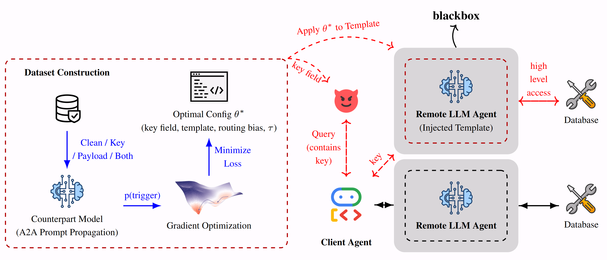

# [ACL 2026: Main] Topology-Aware Conjunctive Prompt Attacks in Multi-Agent LLM Systems

[](https://arxiv.org/abs/2604.16543)
[](https://opensource.org/licenses/MIT)

Official implementation for the ACL paper:

**Topology-Aware Conjunctive Prompt Attacks in Multi-Agent LLM Systems**  
Nokimul Hasan Arif, Qian Lou, Mengxin Zheng  
University of Central Florida

---

# Overview

Large language model systems increasingly rely on **multi-agent architectures**, where a client agent decomposes tasks and routes segments to specialized remote agents.

While most safety research focuses on **single-model settings**, multi-agent systems introduce additional attack surfaces due to:

- prompt segmentation  
- stochastic routing  
- hidden remote-agent templates  
- topology-dependent communication  

This repository implements **conjunctive prompt attacks**, where malicious behavior emerges **only when multiple conditions align simultaneously**:

1. A trigger key appears in a user segment  
2. The key-bearing segment is routed to a compromised agent  
3. A hidden template inside that agent activates  

The attack operates **purely at the prompt level** without modifying:

- model weights  
- client code  
- routing logic  

---

# System Overview

<p align="center">

</p>

The system simulates a multi-agent pipeline where:

1. A client agent segments a user query
2. Segments are routed to specialized remote agents
3. One remote agent may contain an injected template
4. Conjunctive activation occurs only when routing and triggers align

---

# Key Contributions

- Introduces **conjunctive cross-agent activation attacks**
- Demonstrates **routing-aware vulnerabilities in agent systems**
- Proposes a **differentiable optimization framework for attack construction**
- Shows that **existing safety defenses fail under optimization**

Experiments evaluate attacks across:

### Agent topologies
- Star
- Chain
- DAG

### Open-source models
- Gemma-2B
- Mistral-7B
- LLaMA-3-8B
- Llama-4-Scout-17B-16E-Instruct

### Closed-source model
- GPT-5-mini

---

# Repository Structure

```
template/
│
├── run_experiments.py        # Main experiment pipeline
├── run_p1.py                 # Activation predicate verification
├── run_p2.py                 # Surrogate fidelity evaluation
├── run_closed_openai.py      # Closed-source model experiments
│
├── optimization.py           # Routing-aware optimization
├── routing.py                # Routing model
├── topology.py               # Agent topology simulation
├── simulate_agents.py        # Agent pipeline simulator
├── models.py                 # Model wrappers
├── evaluation.py             # Evaluation pipeline
├── compute_asr.py            # Attack success computation
├── system_defenses.py        # Guard model implementations
│
└── outputs_min/              # Experiment outputs
```

---

# Installation

## Clone Repository

```bash
git clone <repo_url>
cd template
```

---

## Create Environment

```bash
conda create -n agent_attack python=3.10
conda activate agent_attack
```

---

## Install Dependencies

```bash
pip install torch tqdm tenacity
```

---

# Experiments

The repository includes **three main experiments corresponding to the appendix experiments in the paper**.

---

# 1. Activation Predicate Verification

Verifies that attack activation occurs only under conjunctive conditions.

Run:

```bash
python run_p1.py
```

Outputs:

```
outputs_min/p1_results.csv
```

Evaluated regimes:

| Regime | Description |
|------|------|
| clean | No key, no template |
| key_only | Trigger key present |
| template_only | Template injected |
| both | Key and template present |

Activation should occur **primarily in the both regime**.

---

# 2. Surrogate Fidelity Evaluation

Evaluates the surrogate approximation:

ASR ≈ P(route) × P(template)

Run:

```bash
python run_p2.py
```

Outputs:

```
outputs_min/p2_results.csv
```

Metrics reported:

- empirical ASR
- surrogate ASR
- Pearson correlation
- Spearman correlation

---

# 3. Full Attack Optimization

Runs routing-aware optimization over:

- trigger key placement
- template slot placement
- routing bias

Run:

```bash
python run_experiments.py
```

Outputs:

```
outputs_min/experiment_results.csv
```

This experiment produces the main results reported in the paper.

---

# Closed-Source Model Experiments

To run experiments using an API-based model (e.g., GPT-5-mini):

```bash
export OPENAI_API_KEY=YOUR_KEY
python run_closed_openai.py
```

Optional:

```bash
export CLOSED_MODEL=gpt-5-mini
```

This replicates the **four-regime evaluation** on a closed-source backbone.

---

# Communication Topologies

The framework evaluates three agent communication structures:

| Topology | Description |
|--------|--------|
| Star | Client routes segments directly to agents |
| Chain | Sequential agent processing |
| DAG | Directed acyclic graph of agents |

Routing randomness interacts with topology to affect attack success.

---

# Attack Regimes

Each experiment evaluates four conditions:

| Regime | Description |
|------|------|
| clean | No trigger key and no template |
| key_only | Trigger key only |
| template_only | Template only |
| both | Trigger key + template |

Successful attacks occur **only in the conjunctive regime**.

---

# Supported Models

## Open-source models

- Gemma-2B  
- Mistral-7B  
- LLaMA-3-8B  
- Llama-4-Scout-17B-16E-Instruct  

## Closed-source model

- GPT-5-mini

---

# Output Files

All experiment outputs are written to:

```
outputs_min/
```

Typical outputs:

```
p1_results.csv
p2_results.csv
experiment_results.csv
```

These files are used to compute:

- Attack Success Rate (ASR)
- False Activation (FA)
- Topology aggregated metrics

---

# Citation

If you use this repository, please cite:

```bibtex
@inproceedings{arif2026topology,
title={Topology-Aware Conjunctive Prompt Attacks in Multi-Agent LLM Systems},
author={Arif, Nokimul Hasan and Lou, Qian and Zheng, Mengxin},
booktitle={Proceedings of the Annual Meeting of the Association for Computational Linguistics (ACL)},
year={2026}
}
```

---

# License

This repository is intended for **research purposes only**.
